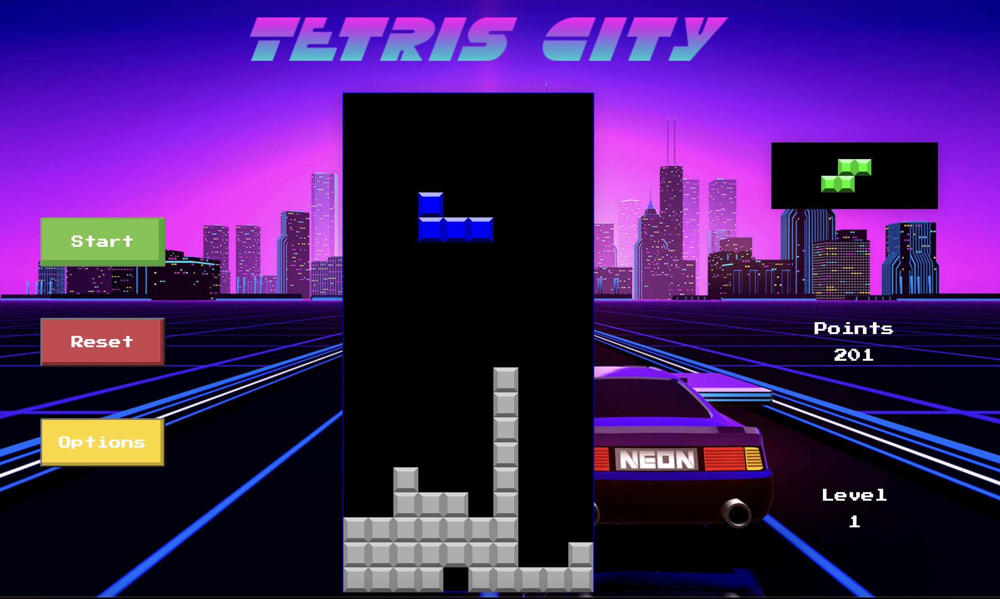
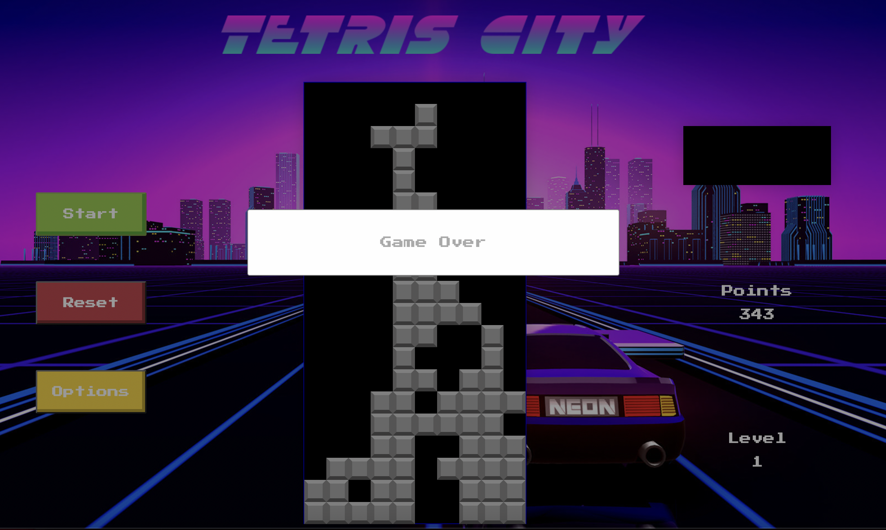

# SEI-Project-one

## Overview:
This was the first project for the Software Engineering Immersive course with GA. We were given a timeline of one week to pick a game from a list of options then re-create it using HTML, CSS and JavaScript. I chose to make Tetris.

Check out my version [here](https://greezybob.github.io/SEI-Project-one/)!

## Brief:
* Render a game in the browser.
* Design a logic for the gameplay, player scoring, levels and game end.
* Use semantic markup for HTML and CSS
* Use JavaScript for DOM manipulation and game logic.
* Deploy the game online.

## Technologies Used:

### Languages:
* JavaScript (ES6+)
* HTML5 & HTML5 Audio
* CSS

### Dev Tools:
* VSCode
* Eslint
* Git
* GitHub
* Google Fonts
* Google Chrome Dev Tools

## Approach:
In the beginning I focused on wireframing out the layout of my game. I decided what semantic HTML elements I would use and how they would be placed in the web browser. After this step I began to write some pseudo code breaking my game down into 5 key stages

### Spawn a randomly generated tetrimino
Have the tetrimino fall to the bottom of the screen and stop
Allow user to move the tetrimino left, right and down with collision detection on walls and other blocks
Allow user to rotate the tetrimino 90 clockwise
Have a completed row be cleared and have all blocks above fall down


### Grid Creation:

To start, I wrote up the HTML for the game based on my wireframe, then used JavaScript and DOM manipulation to both create the main grid and mini grid for the game, storing each div created as a cell within an array.


### Tetrimino Creation:
As each tetrimino would be spawning in the top-center of my grid I could create the tetriminos using the same starting reference point. Each tetrimino is four nested arrays that correspond to the rotation index of the shape. The values within the nested arrays correspond to a certain position from the start point. Using a Math.rand() I generated a random number and based on its value picked one of the tetrimino arrays. I could then iterate through these arrays and add a class to each div with that position value allowing the tetrimino to be visible.

```
const tetrisO = [
    [0, 1, width, width + 1]
  ]
  const tetrisI = [
    [width - 1, width, width + 1, width + 2],
    [1, 1 + width, 1 + (2 * width), 1 + (3 * width)],
    [width - 1, width, width + 1, width + 2],
    [1, 1 + width, 1 + (2 * width), 1 + (3 * width)]
  ]
  const tetrisL = [
    [1, width - 1, width, width + 1],
    [0, width, (2 * width), (2 * width) + 1],
    [- 1 + width, (2 * width) - 1, width, 1 + width],
    [0, width, (2 * width), -1]
  ]
  const tetrisJ = [
    [-1, width - 1, width, width + 1],
    [0, width, (2 * width), 1],
    [(2 * width) + 1, width - 1, width, width + 1],
    [0, width, (2 * width), (2 * width) - 1]
  ]
  const tetrisT = [
    [0, width - 1, width, width + 1],
    [0, width, (2 * width), width + 1],
    [(2 * width), width - 1, width, width + 1],
    [0, width, (2 * width), width - 1]
  ]
  const tetrisS = [
    [0, 1, width - 1, width],
    [0, width, width + 1, (2 * width) + 1],
    [0, 1, width - 1, width],
    [0, width, width + 1, (2 * width) + 1]
  ]
  const tetrisZ = [
    [0, -1, width, width + 1],
    [1, width, width + 1, (2 * width)],
    [0, -1, width, width + 1],
    [1, width, width + 1, (2 * width)]
  ]
  ```


### Falling Tetrimino:
To make the tetrimino fall down I needed to remove the tetrimino at its current position. Increase the start position by the width of my grid and then recreate the tetromino using this new start position. I could then put this function inside a setInterval() to repeat this process every second. I also had to ensure that the function checked if any of the values in the array were equal to the bottom row of my grid and only run the falldown function if this was not the case.

### Movement:
To allow the user to be able to move tetrominoes I had to be conscious of was movement that would wrap the tetromino on the left or right edges of the grid, and any movement into an existing tetromino. To prevent this, I used if statements that blocked movement left/right if the shape was at all present in the left/right-most column, or if its new position already contains a paused cell.


### Rotation:
One of the more challenging parts of the game was ensuring each piece could be rotated by the player. In my solution I check to see if the rotation index is increased by 1 do any blocks contain a ‘dead’ class and if not then the rotation can be executed. I had to make individual cases for when a block is near a wall or the floor.


### Clearing a row:
After a tetromino is turned into a dead tetrimino I split each row into its own array and iterate over them to see if all the items within that array contain the ‘dead’ class. If this condition is met I remove those rows and increase the points. I then have a while loop which runs until the last array which was removed contains a dead block. Inside the loop every ‘dead’ block that is left over has its position increased by the width of the grid


## Future Features:

If I had more time, these are the features I would have loved to incorporate next:

* Hard Drop for Tetrominoes -  check the columns the current shape is in, then find which row has the highest paused cell. I would lower the current shape to that  row less the width by increasing the currentPosition value
* Highscore - allow users to log their scores using localStorage.


## Images:




